# Ansible Configuration Management (Automate Project 7 to 10)
## Introduction

In Projects 7 to 10, I performed several manual tasks to provision virtual servers, install and configure software, and deploy web applications. Each server had to be configured individually from installing packages and editing configuration files to setting up shared storage, databases, and load balancers.

As infrastructure grows, performing these repetitive tasks manually becomes inefficient, time-consuming, and prone to errors. This project introduces Ansible Configuration Management, which automates routine administrative tasks using a declarative language, YAML, to define the desired state of infrastructure rather than executing commands manually on each server.
Ansible Client as a Jump Server (Bastion Host)

A Jump Server, also known as a Bastion Host, is an intermediary server that provides secure access to resources within an internal network. In a properly secured architecture, web servers reside in a private subnet and are not directly accessible from the internet — not even through direct SSH connections. Access is granted only through the Jump Server, which improves security by reducing the attack surface.

In this architecture, the Virtual Private Cloud (VPC) is divided into two subnets:

    Public Subnet: Contains resources with public IP addresses that are reachable from the internet.
    Private Subnet: Contains internal resources that are accessible only through private IP addresses and are not directly exposed to the internet.

Objectives

    Install and configure an Ansible client to function as a Jump Server (Bastion Host).
    Create and execute simple Ansible playbooks to automate server configuration tasks.

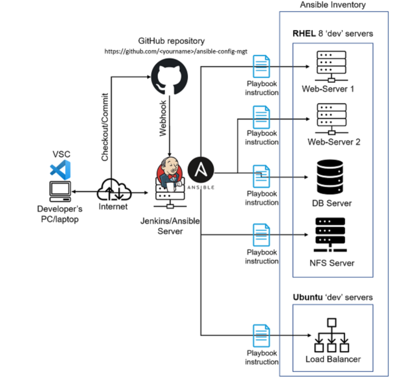

Note: in this implementation, the DB Server actually runs Ubuntu (not RHEL 8 as shown), and was grouped with the Load Balancer under the apt-based play.
# Step 1 – Install and Configure Ansible on EC2 Instance.

1\. Rename your Jenkins EC2 instance.

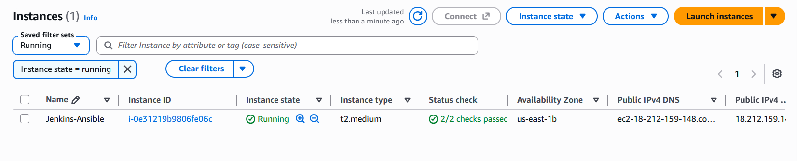

2\. Connect to the Jenkins-Ansible instance

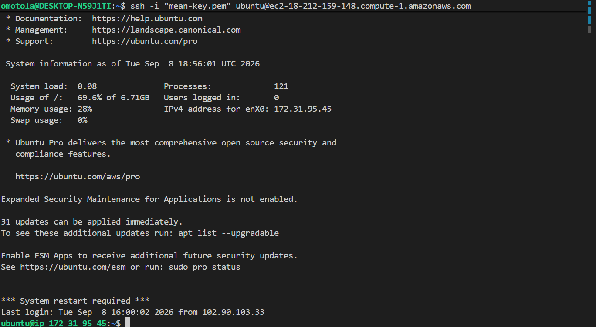

3\. Install Ansible

```
sudo apt update
sudo apt install ansible
```
4\. Then check the version
```
ansible --version
```
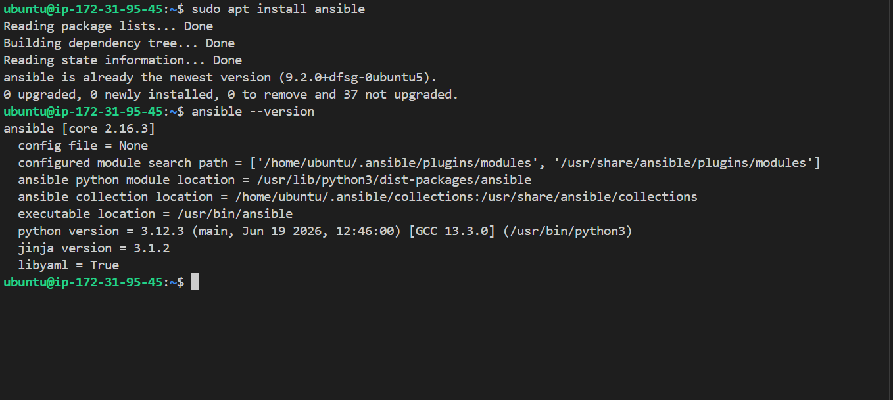

5\. Configure Jenkins build job to archive your repository content every time you change it.

* Create a new Freestyle project ansible in Jenkins and point it to your 'ansible-config-mgt' repository.

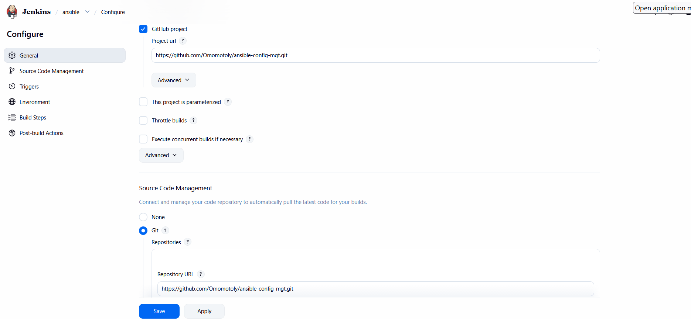 
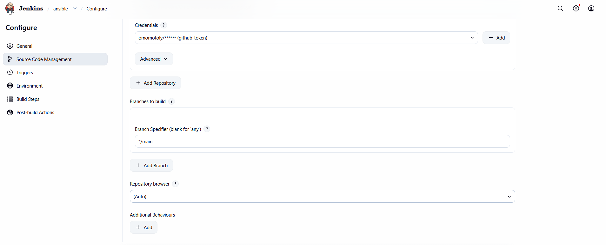
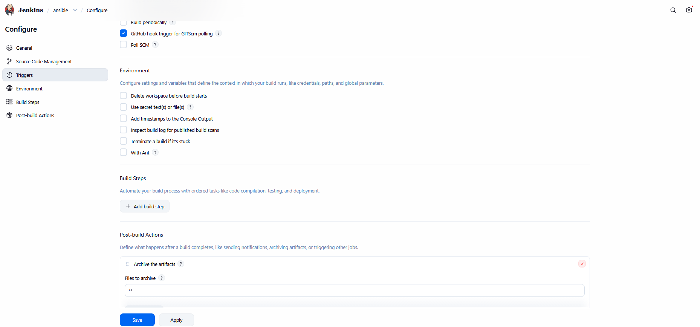

* Configure a webhook in GitHub and set the webhook to trigger ansible build.

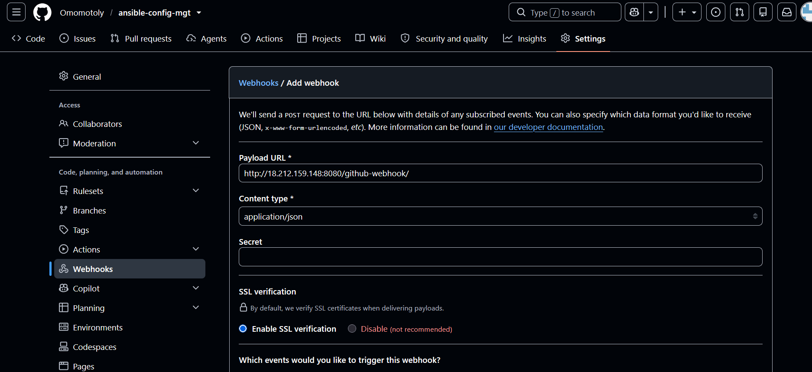

* Test the setup by making some change in README.md file in main branch and make sure that builds starts automatically and Jenkins saves the files (build artifacts) in following folder

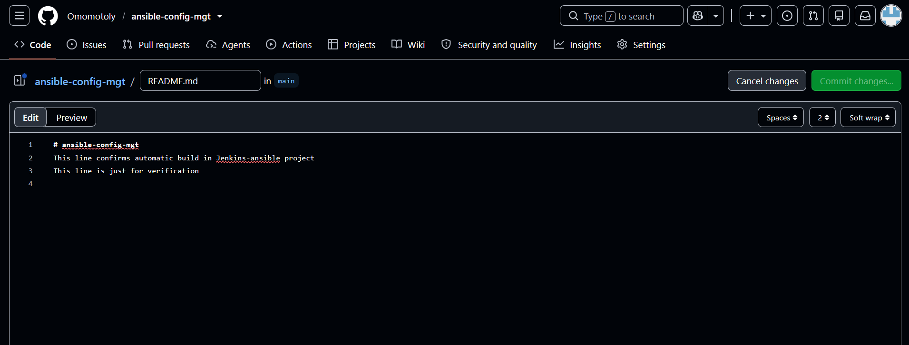
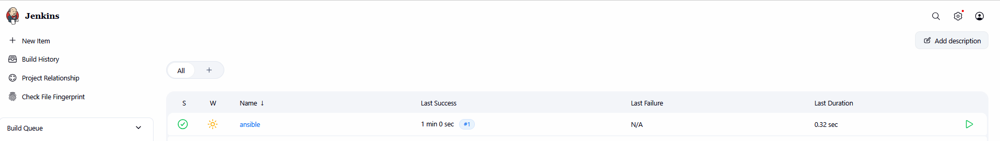

* Verified the archived artifacts from the successful build:

```
ls /var/lib/jenkins/jobs/ansible/builds/1/archive/
cat /var/lib/jenkins/jobs/ansible/builds/1/archive/README.md
```
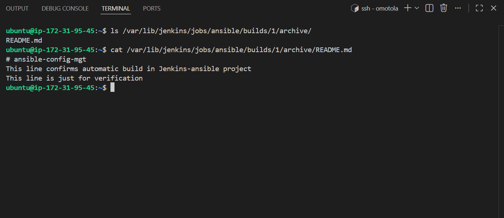

This confirms Jenkins successfully archived the updated README.md from the main branch after the webhook-triggered build.

# Step 2 - Prepare your development environment using Visual Studio Code

Clone down the ansible-config-mgt repo to the Jenkins-Ansible instance.

```
git clone https://github.com/Omomotoly/ansible-config-mgt.git
```
13

VS Code was already installed and configured with Remote-SSH access to the Jenkins-Ansible instance from prior setup, so this step required no additional configuration.
Step 3 - Begin Ansible Development.

    Create a feature branch In your ansible-config-mgt repo, create a new branch from main for development:

git checkout -b feature/prj-11-ansible-config

14

    Create a directory and name it playbooks – It will be used to store all your playbook files.

    Create a directory and name it inventory – It will be used to keep your hosts organised.

    Within the playbooks folder, create your first playbook, and name it common.yml.

    Within the inventory folder, create an inventory file () for each environment (Development, Staging, Testing and Production) dev, staging, uat, and prod respectively. These inventory files use .ini languages style to configure Ansible hosts.

15

16
Step 4 — Set Up an Ansible Inventory

An Ansible inventory defines the hosts and groups of hosts on which commands, modules, and tasks in a playbook operate. Since our intention is to execute Linux commands on remote hosts, it's important to have a way to organize our hosts in an inventory.

    Loaded the private key into ssh-agent on the local machine and connected to the Jenkins-Ansible server with agent forwarding.

Ansible uses TCP port 22 by default, which means it needs to reach the target servers via ssh — from Jenkins-Ansible. For this, you'll implement the concept of ssh-agent, so you don't need to import your private key into ssh-agent manually.

On your local machine (not the Jenkins-Ansible server):

eval `ssh-agent -s`
ssh-add server-key.pem

17 18

    Confirmed the key was successfully forwarded to the Jenkins-Ansible server:

ssh-add -l

19

    Updated inventory/dev.yml with the private IP addresses of the servers from Projects 7–10:

[nfs]
172.31.36.99 ansible_ssh_user=ec2-user

[webservers]
172.31.36.90 ansible_ssh_user=ec2-user
172.31.47.217 ansible_ssh_user=ec2-user

[db]
172.31.36.136 ansible_ssh_user=ec2-user

[lb]
172.31.16.253 ansible_ssh_user=ubuntu

20

    Tested connectivity to all hosts defined in the inventory using Ansible's ping module:

ansible all -i inventory/dev.yml -m ping

This verifies Ansible can successfully connect to each host via SSH (using the forwarded key) and run a module, before proceeding to write the actual configuration playbook.

Troubleshooting note: Running ansible ... -m ping against multiple hosts in parallel caused SSH host-key confirmation prompts to collide, since Ansible connects to all hosts simultaneously but the terminal can only respond to one prompt at a time. Resolved by manually SSH-ing into each host individually first (accepting the fingerprint with yes), which populated ~/.ssh/known_hosts for all hosts before re-running the Ansible ping test.

21 22 23

Ran the command again

ansible all -i inventory/dev.yml -m ping

24
Step 5 — Create a Common Playbook

Wrote instructions for Ansible to perform on all servers listed in inventory/dev.yml. The common.yml playbook holds configuration for repeatable, re-usable, multi-machine tasks common to all systems in the infrastructure.

Updated playbooks/common.yml with the following code:

---
- name: update web, nfs and db servers
  hosts: webservers, nfs, db
  become: yes
  tasks:
    - name: ensure wireshark is at the latest version
      yum:
        name: wireshark
        state: latest

- name: update LB server
  hosts: lb
  become: yes
  tasks:
    - name: Update apt repo
      apt:
        update_cache: yes

    - name: ensure wireshark is at the latest version
      apt:
        name: wireshark
        state: latest

This playbook is split into two plays: the first installs/updates wireshark on the RHEL 8 servers (webservers, nfs, db) using yum; the second does the same on the load balancer (lb) using apt, after refreshing the package cache. Both plays use become: yes to run as the root user.

25
Step 6 - Update GIT with the latest code

At this point, all directories and files existed locally on the Jenkins-Ansible server, and needed to be pushed to GitHub.

In a real-world team setting, it's important to collaborate using Git properly. Many organizations enforce a rule that no code is deployed before it's been reviewed by an extra pair of eyes — known as the "Four Eyes Principle." Since a separate feature branch had already been created, the next step was to raise a Pull Request (PR), have the branch peer-reviewed, and merge it into the main branch.

Commit your code into GitHub:

    Use git commands to add, commit and push your branch to GitHub.

26 27 28

    Create a Pull Request (PR)

30 31 32

    Checkout from the feature branch into the main, and pull down the latest changes.

33

    After merging the pull request into main, Jenkins automatically triggered a new build (build #3) via the GitHub webhook, confirming the CI pipeline correctly picks up changes from main.

34

Confirm the archive actually contains your new files, not just README.md

ls /var/lib/jenkins/jobs/ansible/builds/3/archive/

35

This confirms Jenkins correctly picked up and archived the full updated repository content from main, including the new inventory/ and playbooks/ directories.
Step 7 — Run the First Ansible Test

Run the playbook:

ansible-playbook -i inventory/dev.yml playbooks/common.yml

D

Troubleshooting note: The first run failed on the DB server with Could not detect which major revision of yum is in use, since the DB Server actually runs Ubuntu (not RHEL, as originally assumed). Fixed by restructuring common.yml to group db with lb under the apt play instead of the yum play.

E

Re-ran the playbook — completed successfully with failed=0 across all 5 hosts.

36 37

Verified Wireshark was installed on every host:

ansible all -i inventory/dev.yml -a "which wireshark"

38

Output confirmed /usr/bin/wireshark on all 5 servers.
