# Ansible Configuration Management (Automating Projects 7–10)

Projects 7 through 10 provided hands-on experience with core DevOps tasks—such as server provisioning, software installation, and application deployment. However, completing these processes manually made it clear that non-automated operations are slow, highly repetitive, and prone to human error..

Ansible Configuration Management solves this challenge by automating workflows through human-readable YAML playbooks. Instead of executing commands manually, you simply state your target configuration, and Ansible ensures system states remain predictable, uniform, and efficient across all environments.

Migrating these manual setups to Ansible replaces tedious overhead with industry-standard practices, unlocking key DevOps capabilities like scalable infrastructure, predictable deployments, and fully repeatable configurations.

## Ansible Client as a Jump Server (Bastion Host)

Before diving into playbooks, let’s discuss the architecture.

A Jump Server (also called a Bastion Host) is a secure, intermediary server that acts as a bridge between external users and the internal infrastructure. In a production-grade setup:

* Web servers and databases are placed in private subnets for security.
* These internal servers cannot be accessed directly from the internet.
* Instead, engineers connect to a Jump Server that is allowed inbound access (e.g., via SSH).
* From the Jump Server, they can securely connect to internal servers.

This architecture significantly reduces the attack surface because external access is funneled through a single controlled point, improving monitoring and security compliance.

In our setup, we configure the Ansible Client to act as the Jump Server(Bastion). That means:

* We’ll install Ansible on the Jump Server.
* The Jump Server will have SSH access to other servers (web, database, etc.).
* From this central point, Ansible can push configurations and run playbooks across all target servers.

## Tasks Breakdown
### 1. Install and Configure Ansible Client

The first step is to set up Ansible on the Jump Server. Once installed, the server will serve as the control node from which all automation is executed.

Key points:

* Ansible requires only Python and SSH access to manage remote hosts.
* No agent needs to be installed on the target servers (unlike Puppet or Chef).
* Configuration is defined in an inventory file listing the managed hosts.

### 2. Create a Simple Ansible Playbook

An Ansible playbook is a YAML file that describes the desired configuration of target servers. Playbooks define tasks such as:

* Installing packages (e.g., Nginx, Apache, MySQL).
* Copying configuration files.
* Starting and enabling services.

Instead of manually logging into each server and running commands, a playbook allows you to declare the final state you want, and Ansible enforces it automatically.

Example (simplified):

```yaml
- name: Configure Web Server
hosts: webservers
become: yes
tasks:
- name: Install Nginx
    apt:
    name: nginx
    state: present
- name: Start Nginx service
    service:
    name: nginx
    state: started
    enabled: yes
```
This playbook ensures all servers in the webservers group have Nginx installed, running, and enabled on startup — without logging into each one.

# Architectural Diagram

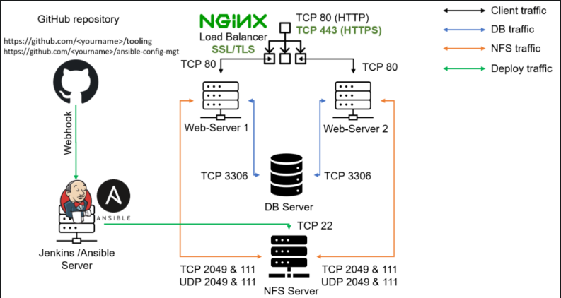
## Automation Steps

This section turns the short checklist into a reproducible, secure workflow: 
1\. Prepare the Jenkins instance as an Ansible control/jump host
2\. Wire it to GitHub, and
3\. Configure Jenkins to archive your Ansible repo on every change to main. 

## Why this pattern?

We make Jenkins also our Ansible control node / jump server so:

Jenkins can react automatically to Git commits (CI trigger → artifact snapshot).
Ansible runs from a single hardened point that has SSH access to private hosts (bastion pattern).
You keep infrastructure-as-code (Git) and automated execution (Jenkins + Ansible) closely integrated.

## Step 1: Install & Configure Ansible on an EC2 Jenkins (Jenkins-Ansible) Jump Server
### 1. Rename the EC2 instance from Jekins to Jenkins-Ansible 

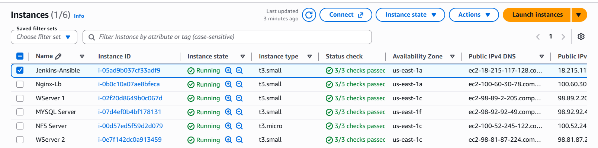


### 2. Create GitHub repo ansible-config-mgt

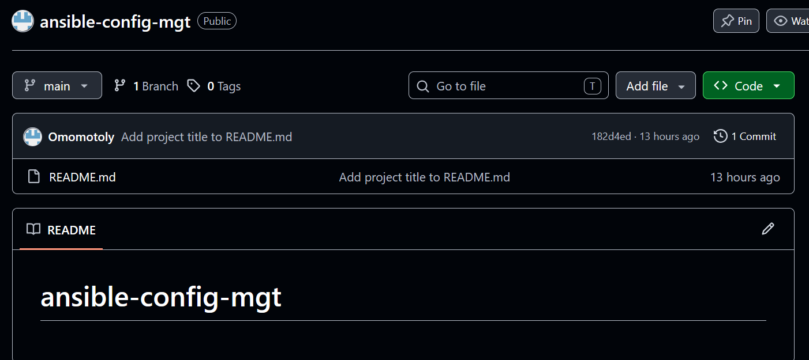 

Then clone the repo on the Jenkins-Ansible instance:

```
git clone https://github.com/Omomotoly/ansible-config-mgt.git
cd ansible-config-mgt
```
### 3. Install Ansible on Jenkins-Ansible (control node)
```
sudo apt update
sudo apt install -y ansible git
ansible --version
```
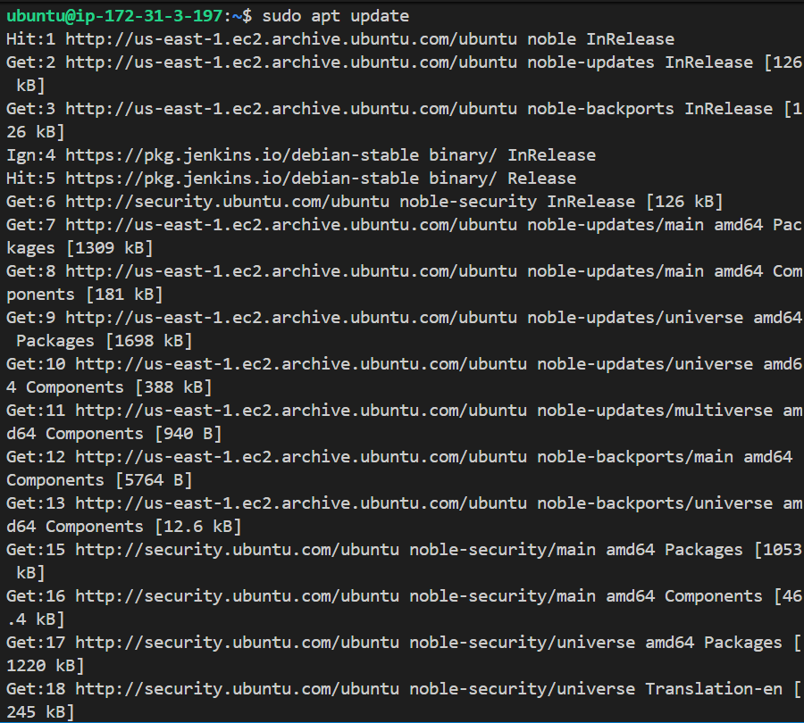 
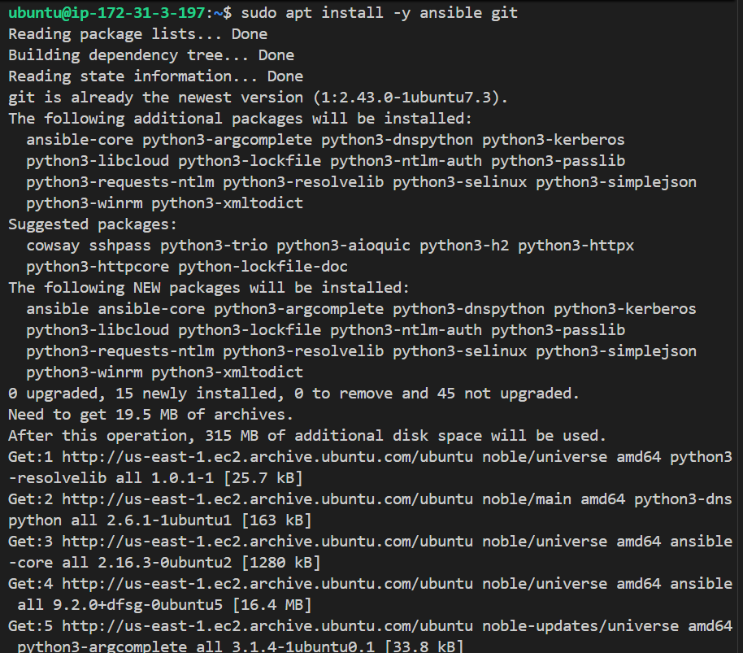 
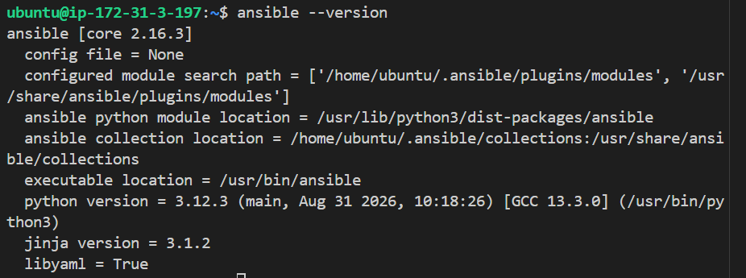

###  4. Configure Jenkins build job to archive ansible-config-mgt repo

* **Create a Jenkins Freestyle project**

   * Log into your Jenkins dashboard → New Item.

   * Enter project name: ansible.

   * Inside project config:

* **Connect GitHub repo created earlier (ansible-config-mgt) SCM setup**

  * Under Source Code Management, choose Git.

  * Repository URL:

    ```
    https://github.com/<your-username>/ansible-config-mgt
    ```
  * Credentials:

    HTTPS: add a GitHub personal access token in Jenkins Credentials store.

  * Branch specifier:
    ```
    */main
    ```

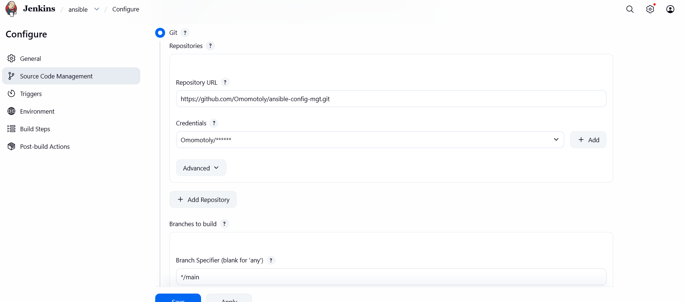
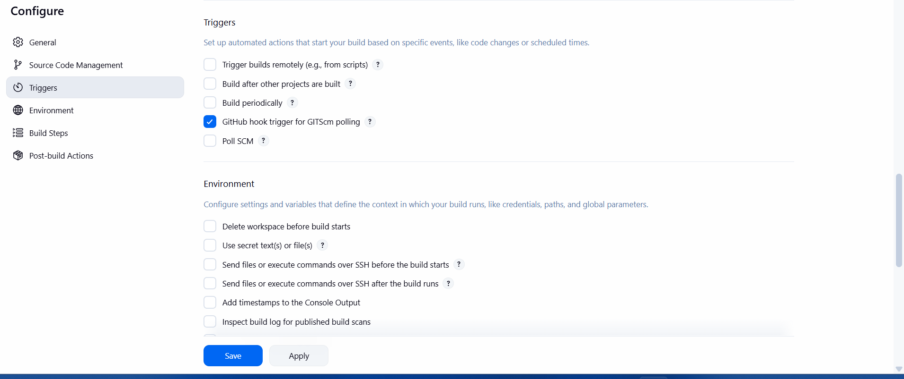

* **Configure GitHub Webhook**

    **On the GitHub repo:**

    i. Go to Settings → Webhooks → Add Webhook.

   ii. Payload URL:

    ```
    http://<jenkins-ansible-server-public-IP>:8080/github-webhook/
    ```
  iii. Content type: application/json

   iv. Choose Just the push event.

    v. Save.

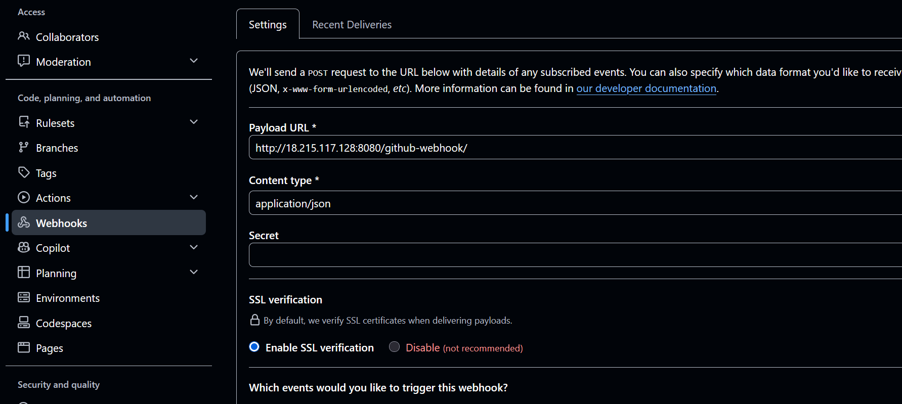
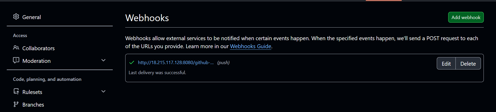

On Jenkins:

* In project config → Build Triggers → select:

GitHub hook trigger for GITScm polling

  This ensures Jenkins will build whenever there’s a push to main.

* **Configure Post-Build Archiving**

    Now, we want Jenkins to save the repo snapshot after every build:

   i. Scroll to Post-build Actions → select Archive the artifacts.

   ii. Files to archive:

    `**/*`

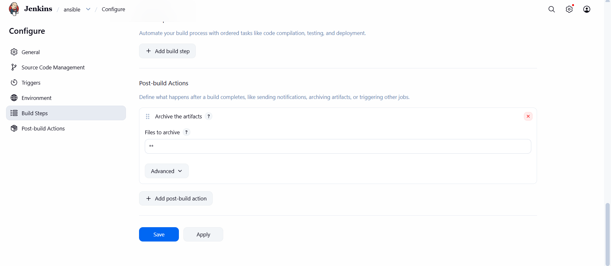

Note: `**/*` means all files recursively in the workspace.

Artifacts will be stored here per build:

```
/var/lib/jenkins/jobs/ansible/builds/<build_number>/archive/
```
* **Test the Setup**

1. Make a change in your repo:

```
echo "Testing CI $(date)" >> README.md
git add README.md
git commit -m "ci: test webhook build"
git push origin main
```
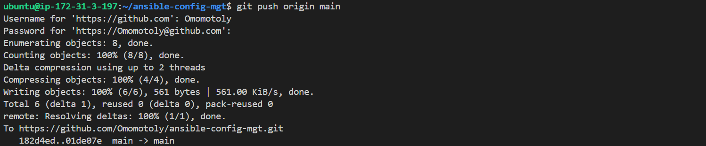

2. GitHub webhook will fire → Jenkins job runs.

3. Check build log in Jenkins dashboard. 
   
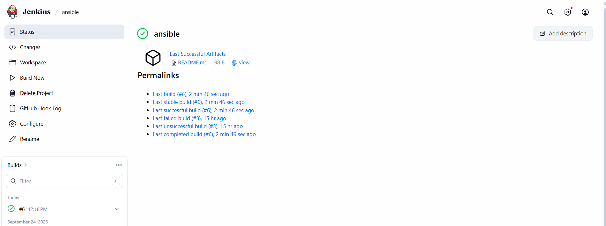

4. Verify artifacts:

```
ls /var/lib/jenkins/jobs/ansible/builds/<build_number>/archive/
```
You should see the full repo snapshot.

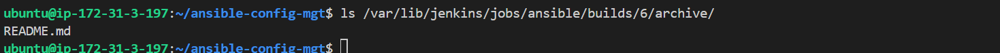

At this point: every Git push to main in ansible-config-mgt → automatically triggers Jenkins → repo snapshot is archived as a build artifact.
## Step 2 — Prepare Your Development Environment Using Visual Studio Code

In a DevOps workflow, your IDE (Integrated Development Environment) is more than just a code editor — it’s your productivity hub. With VS Code:

You can write and debug playbooks with YAML linting and IntelliSense.

Source control integration ensures changes sync seamlessly with GitHub.

Extensions allow for remote development directly on your Jenkins-Ansible server or any EC2 instance.

By preparing VS Code properly, you create a streamlined feedback loop: write → commit → push → CI job runs automatically in Jenkins.
## Install Visual Studio Code

On your local machine (Windows/Mac/Linux):

* Download VS Code from the official website: https://code.visualstudio.com

* Install with default options.

## Configure GitHub Integration in VS Code

To collaborate effectively, connect VS Code to your GitHub repo.

* Authenticate GitHub in VS Code

    * Open VS Code → View → Command Palette → search for GitHub: Sign in.

    * Sign in with your GitHub account (Personal Access Token or browser-based OAuth).

* Clone Repo Directly in VS Code (Optional)

    * Open Source Control tab → “Clone Repository” → paste repo URL.

    * Choose a local folder, VS Code auto-opens the repo.

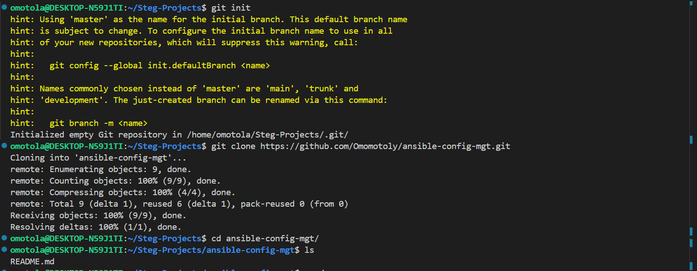


This ensures your local IDE is always in sync with GitHub.

## Clone Repo on Jenkins-Ansible Instance

Since Jenkins will actually run Ansible playbooks, we also need the repo available on the EC2 server. SSH into your Jenkins-Ansible instance and run:

```
git clone <ansible-config-mgt repo link>
```
Expected output:

Cloning into 'ansible-config-mgt'...
remote: Enumerating objects: 5, done.
remote: Counting objects: 100% (5/5), done.
Unpacking objects: 100% (5/5), done.

Now verify:
```
cd ansible-config-mgt
ls
```
You should see your project files (e.g., README.md).

At this stage:

* You have VS Code installed locally with GitHub integration.
* Repo is cloned both on your local machine (for coding) and Jenkins-Ansible EC2 (for execution).

## Step 3 – Begin Ansible Development

After setting up Ansible and integrating Jenkins with GitHub, the next step is to structure your Ansible project for scalability, collaboration, and maintainability. In DevOps, establishing a clean directory structure early ensures that teams can extend and automate infrastructure management without confusion.

In this step, we will:

Create a new branch for feature development.

Organize directories for playbooks and inventory.

Write the first Ansible playbook (common.yaml).

Set up environment-specific inventory files.

1\. Create a New Branch for Feature Development

Working on the main branch is risky, as it may cause broken automation pipelines if unstable code is merged. Instead, we follow Git best practices: create feature branches for each task or module.

On your local machine or Jenkins-Ansible EC2 instance, run:

### Navigate to your project directory
```
cd ansible-config-mgt
```
### Create and switch to a new branch
```
git checkout -b dev-setup
```
```
git branch
```
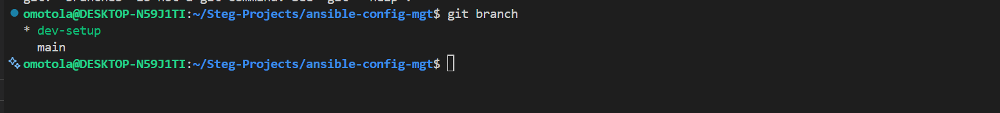

2\. Organize Your Project Structure

Run the following to create directories:

```
mkdir playbooks inventory
```
   * playbooks → stores YAML playbooks (e.g., configuration automation, package installation).
   * inventory → defines groups of hosts across environments (dev, staging, uat, prod).

Your structure now looks like this:

```
ansible-config-mgt/
├── inventory/
├── playbooks/
├── README.md
```
3\. Create Your First Playbook: common.yaml

Playbooks are the heart of Ansible. Each playbook describes tasks that run against specified hosts. Let’s create a common playbook that will define baseline configurations (packages, users, etc.) across all environments.

Inside the playbooks directory, create the file:

nano playbooks/common.yaml

4\. Create Environment-Specific Inventory Files

Ansible inventories allow you to define host groups (dev, staging, uat, prod). Using .ini style makes grouping intuitive.

Inside the inventory directory, create four files:
```
cd inventory
```
```
touch dev.ini staging.ini uat.ini prod.ini
```
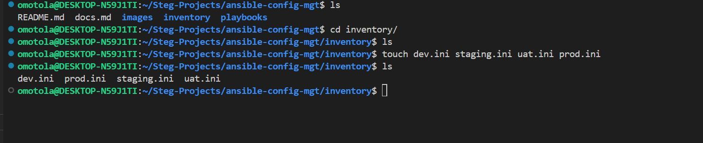

Result:

We now have a Git-controlled project with a scalable structure.

Environments are isolated via inventory files.

common.yaml serves as your baseline for consistent infrastructure configuration.

## Step 4 – Setting Up an Ansible Inventory

An Ansible inventory is the foundation of infrastructure automation. It tells Ansible which servers to target and how to connect to them. For example, you might want to run a task only on your web servers but not on your load balancer or database. With inventory groups, this becomes easy and scalable.

By default, Ansible uses SSH (TCP/22) to connect to remote servers. Since your Jenkins-Ansible instance will be the control node, we’ll configure SSH agent forwarding so Jenkins-Ansible can reach target servers securely.

1\. Enable SSH Agent and Add Your Key

Start the SSH agent and load your private key (the same one used when launching your EC2 servers):

### Start ssh-agent
```
eval `ssh-agent -s`
```
### Add your private key (replace with your path)
```
ssh-add ~/my-aws-key.pem
```
Confirm the key has been added:
```
ssh-add -l
```
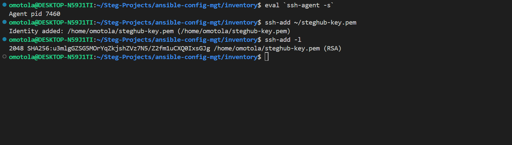

Expected output: fingerprint and name of your key (e.g., 2048 SHA256:xyz my-aws-key.pem).

2\. SSH into Jenkins-Ansible with Agent Forwarding

Agent forwarding (-A) allows your Jenkins-Ansible host to connect to other servers without re-entering the key:

```
ssh -A ubuntu@<jenkins-ansible-public-ip>
```
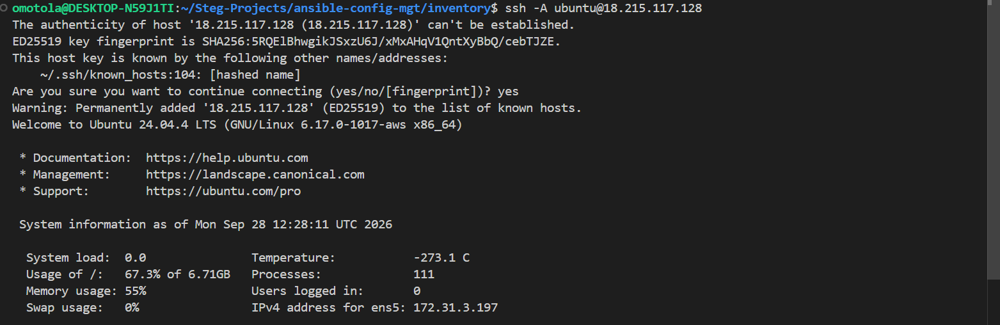

1\. Update Inventory File

Inside your project repo:

```
cd ansible-config-mgt/inventory
nano dev.ini
```
Paste the following (replace <private-ip> values with your actual EC2 internal IPs):

```
[nfs]
<nfs server private ip address> ansible_ssh_user=ec2-user

[webservers]
<web server1 private ip address> ansible_ssh_user=ec2-user
<web server2 private ip address> ansible_ssh_user=ec2-user

[db]
<database private ip address> ansible_ssh_user=ec2-user

[lb]
<load balancer private ip address> ansible_ssh_user=ubuntu
```
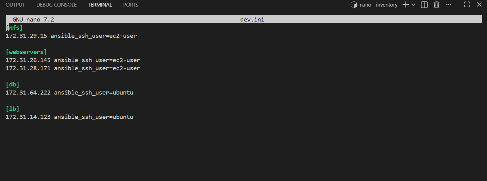

[nfs], [webservers], [db], [lb] are groups you can call in playbooks.
ansible_ssh_user tells Ansible which user account to use for SSH login.

At this point: Your dev environment is structured, and Ansible knows how to connect to each server group.

## Step 5 – Create a Common Playbook

The next step is to write your first reusable playbook: common.yaml. The goal is to install/update a package (wireshark) across both RHEL 8 and Ubuntu servers, using their respective package managers.

1. Create the Playbook File

Inside the playbooks directory:

```
cd ../playbooks
nano common.yaml
```

Paste the following:

```
- name: update web, and nfs servers
hosts: webservers, nfs
become: yes
tasks:
- name: ensure wireshark is at the latest version
    yum:
    name: wireshark
    state: latest

- name: update LB and db server
hosts: lb, db
become: yes
tasks:
- name: Update apt repo
    apt:
    update_cache: yes

- name: ensure wireshark is at the latest version
    apt:
    name: wireshark
    state: latest
```
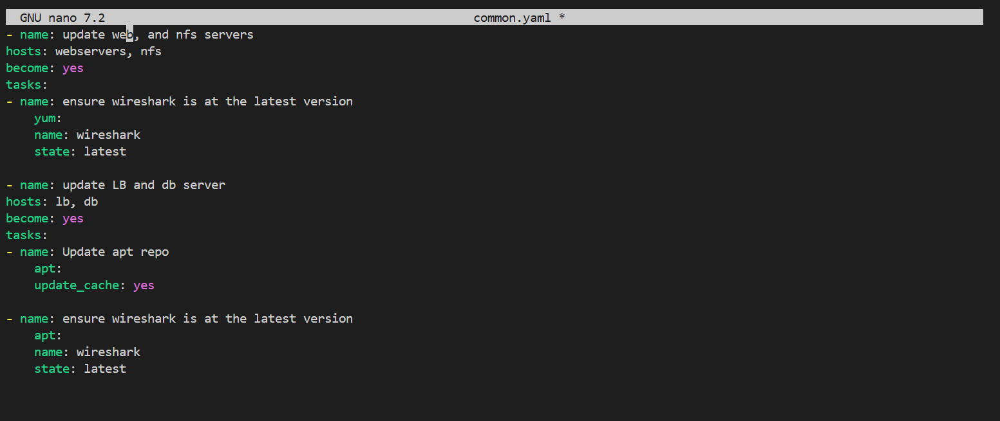

2\. Extend the Playbook

You can add more common configuration tasks like creating directories, changing timezones, or running scripts. Example:

- name: Create a directory and file
    file:
    path: /opt/app/config.txt
    state: touch

- name: Change timezone to UTC
    command: timedatectl set-timezone UTC

- name: Run a shell script
    shell: /home/ubuntu/scripts/deploy.sh

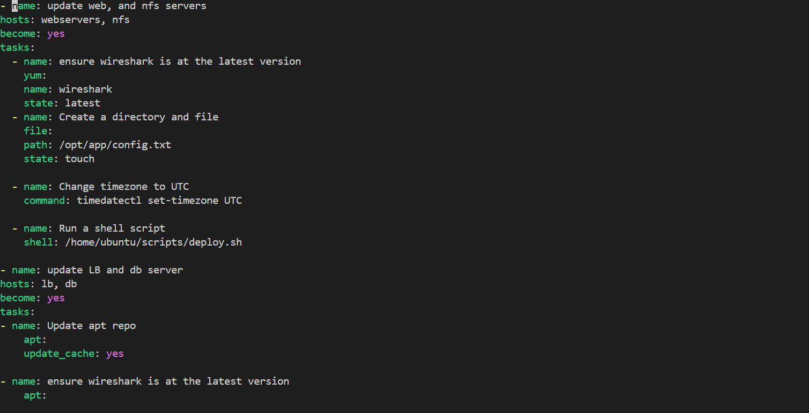

Result:

Wireshark is installed/updated on all servers.

RHEL servers use yum, Ubuntu servers uses apt.

Infrastructure is now consistent and repeatable, forming the baseline for future automation.

This approach highlights a key Ansible principle: separating inventory from playbooks. The same common.yaml can later run against staging or prod inventories without code duplication — ensuring scalability and environment parity.
## Step 6 – Update Git with the Latest Code

With our playbooks and inventory in place, the next step is to push changes to GitHub and let Jenkins handle Continuous Integration (CI). This ensures every update is version-controlled, peer-reviewed, and automatically archived.

1. Stage and Commit Code

From your project directory:

Check changes
```
git status  
```
Stage specific files (or use . to add all)
```
git add playbooks/common.yaml inventory/dev.ini  
```
Commit changes
```
git commit -m "Added common playbook and dev inventory"
```
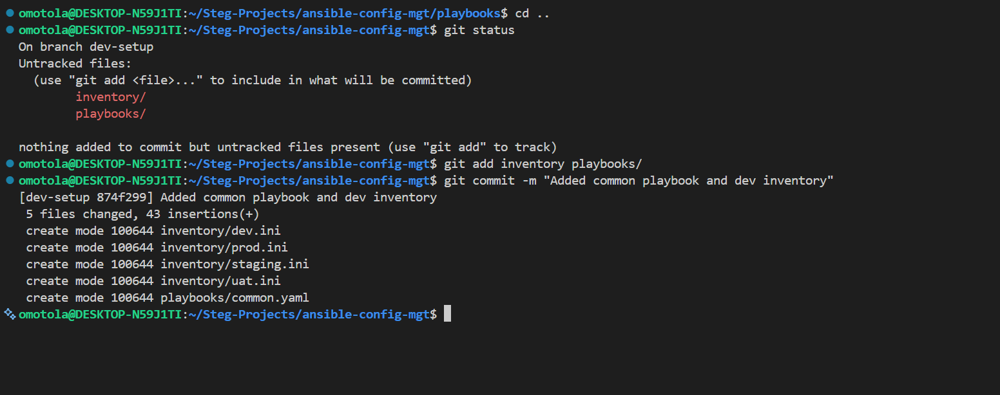

2. Push to Feature Branch

If you’re working on a feature branch (recommended):

```
git push origin dev-setup
```
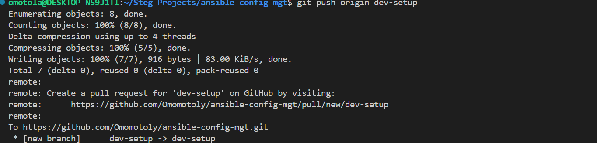

3. Create a Pull Request (PR)

Go to GitHub → open your repo → compare & create pull request from feature-ansible-setup into main.

Add context in the PR description (e.g., “Initial playbook and inventory setup”).

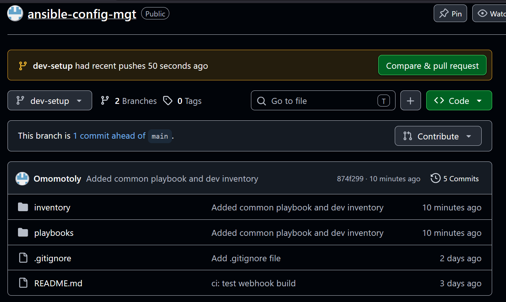 
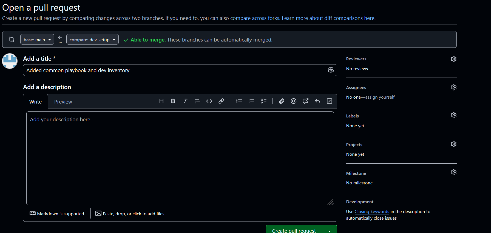

4. Peer Review

As in real-world teams, code reviews are crucial. Another developer (or you wearing the reviewer’s hat) reviews the PR for:

Code quality (proper YAML formatting).

Correct inventory host definitions.

Clear commit messages.

If all looks good, approve and merge into main.

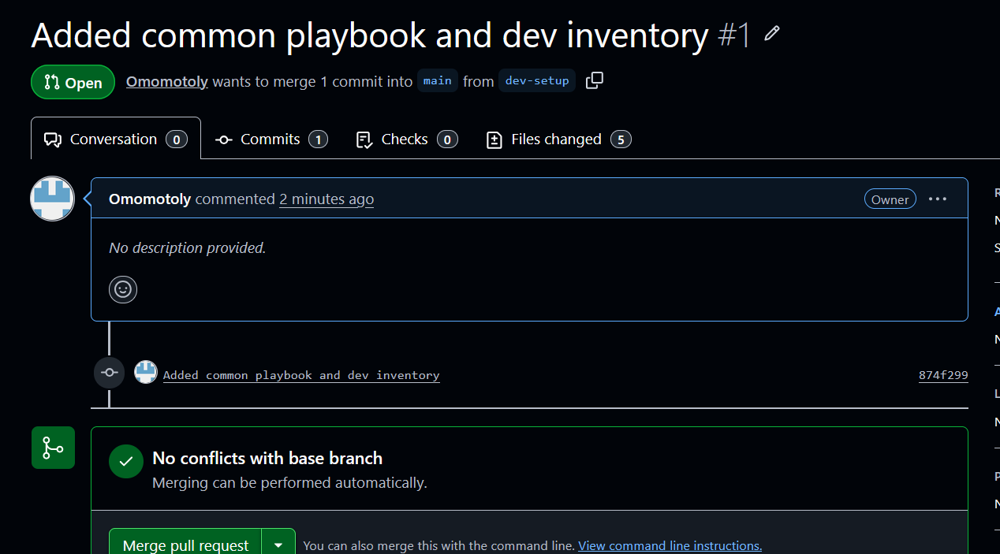 
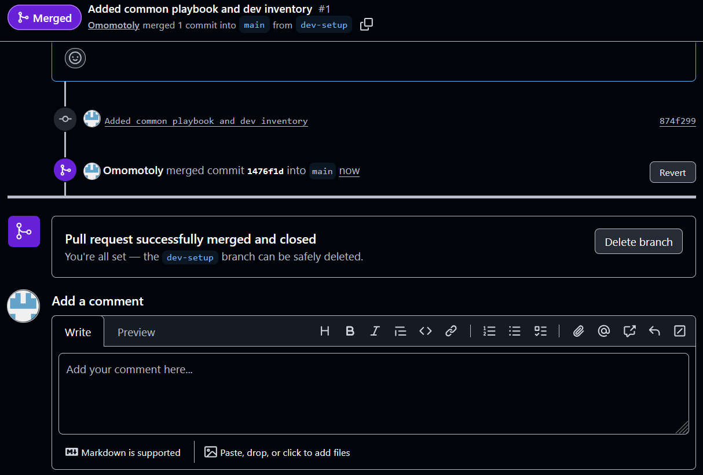

5. Sync Local Repo with Main

After merging:

### Switch back to main
git checkout main  

### Pull latest merged changes
git pull origin main

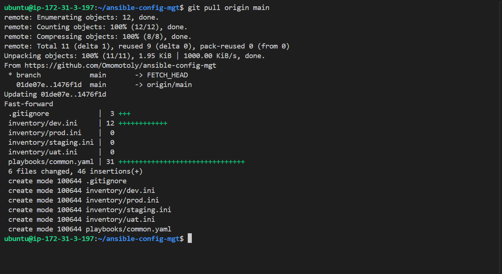

6. Jenkins CI Automation

Once merged, Jenkins (via the configured webhook) triggers a build automatically.

Jenkins checks out the updated repo.

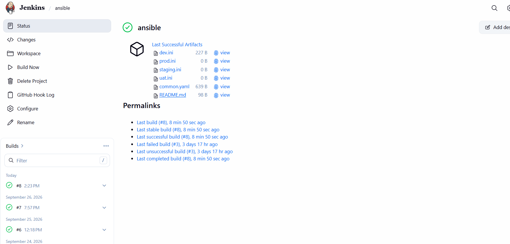 
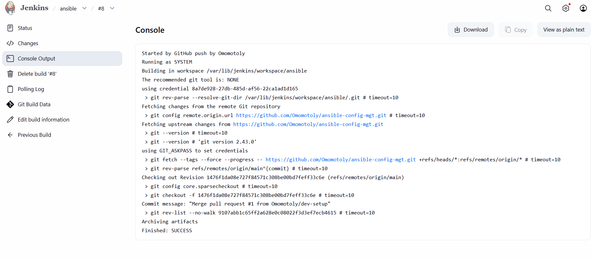

Build artifacts are stored in:

```
ls /var/lib/jenkins/jobs/ansible/builds/<build_number>/archive/
```
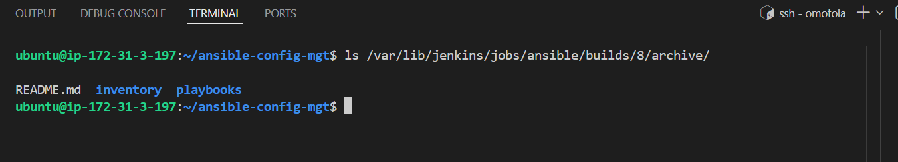

At this point: Your code is safely version-controlled, peer-reviewed, and integrated into Jenkins CI. This process prevents misconfigurations and maintains a single source of truth for automation code.
## Step 7 – Run the First Ansible Test

Now it’s time to validate automation end-to-end by running the common.yaml playbook against dev servers.

### 1. Connect with VSCode Remote SSH

Using the Remote SSH plugin in VSCode, connect to your jenkins-ansible EC2 instance. This allows you to edit code locally in VSCode while executing commands directly on the server.

Edit config file
From your local machine

```
cd ~/.ssh
nano config
```
Add the following code: 
```
Host jenkins-ansible
    HostName <YOUR_EC2_PUBLIC_IP>
    User ubuntu
    IdentityFile ~/.ssh/your-key.pem
```
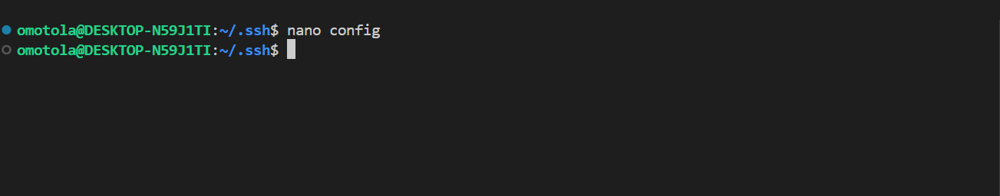
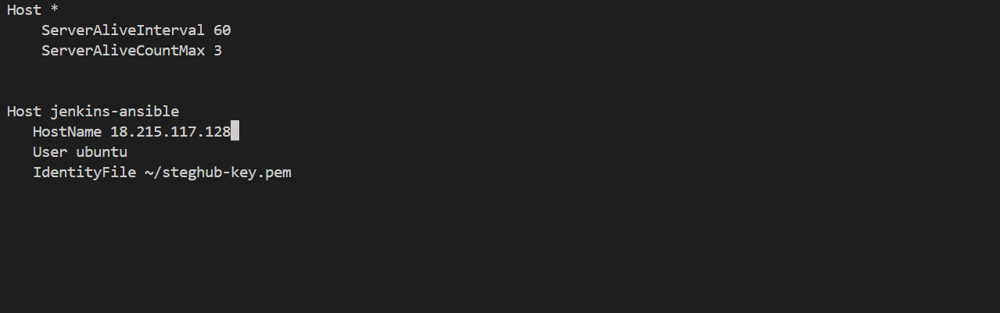

### 2. Execute the Playbook

Navigate into your repo and run the playbook:

```
cd ~/ansible-config-mgt
ansible-playbook -i inventory/dev.ini playbooks/common.yaml
```
* **Problem**: Ansible execution hangs
Running ansible-playbook hung indefinitely after displaying ok: [IP_ADDRESS] during host key verification.
* **Cause**: Ansible operates in non-interactive parallel threads. Because host key checking was active and the remote host keys were not yet accepted in known_hosts, Ansible paused while awaiting background interactive yes/no prompts.
* **Solution**: To resolve the non-interactive prompt block, I pre-populated the ~/.ssh/known_hosts file on the control node using ssh-keyscan to fetch and record public host keys for all managed inventory nodes before running playbooks.
```
sudo -u jenkins bash -c 'ssh-keyscan -H <TARGET_IPs> >> ~/.ssh/known_hosts'
```
Then run the ansible playbook command again

* **Issue**: File Creation Task Failure (/opt/app/config.txt)

* **Error**: Running the playbook failed at the "Create a directory and file" task with fatal: [IP]: FAILED! => {"msg": "Error, could not touch /opt/app/config.txt"}.
* **Cause**: The file module with state: touch attempts to create a file inside a directory path (/opt/app), but the parent directory /opt/app did not exist on the target remote hosts.
* **Resolution**: Updated the playbook to explicitly ensure the target directory exists (state: directory) before creating the file:

Edit the playbook file
```
- name: Ensure /opt/app directory exists
  file:
    path: /opt/app
    state: directory
    mode: '0755'

- name: Create config file
  ansible.builtin.file:
    path: /opt/app/config.txt
    state: touch
    mode: '0644'
```
Then run the ansible playbook command again

* **Issue**: Shell Script Execution Failure (deploy.sh)

* **Error**: Running the "Run a shell script" task failed across target servers with rc: 127 and No such file or directory.
* **Cause**: The shell module attempts to execute /home/ubuntu/scripts/deploy.sh locally on each remote server, but neither the directory nor the script existed on the target hosts.
* **Resolution**: Handled by creating the target directory and deploying a shell script with execute permissions (0755) prior to execution:

```
- name: Ensure deployment script exists
      ansible.builtin.copy:
        dest: /home/ubuntu/scripts/deploy.sh
        content: |
          #!/bin/bash
          echo "Deploy script executed successfully!"
        mode: '0755'
      notify: Run deployment script
```
Added this block at the bottom of the playbook at the handlers section:
```
handlers:
  - name: Run deployment script
    ansible.builtin.command:
      cmd: /home/ubuntu/scripts/deploy.sh
```
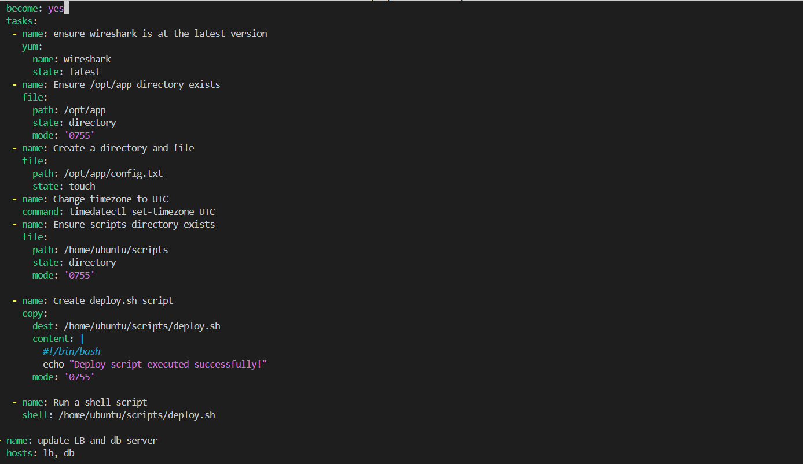

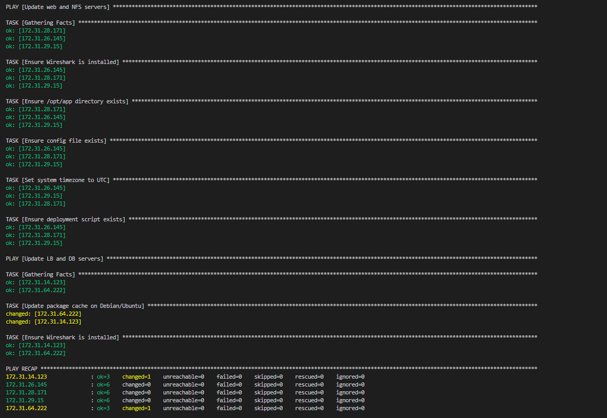


### 3. Verify Installation

On each target server (web, db, nfs, lb), confirm Wireshark was installed:

Check if Wireshark exists in PATH
```
which wireshark  
```
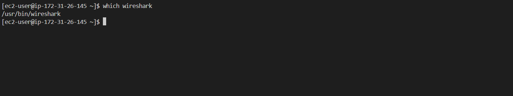

At this point:

Jenkins has archived your updated automation code.

Ansible has successfully executed your first automated configuration across multiple servers.

Manual installation/configuration is officially replaced with infrastructure automation at scale.

This workflow reflects a GitOps model—all infrastructure changes go through Git, are reviewed, and applied automatically through CI/CD pipelines. It ensures traceability, repeatability, and scalability.